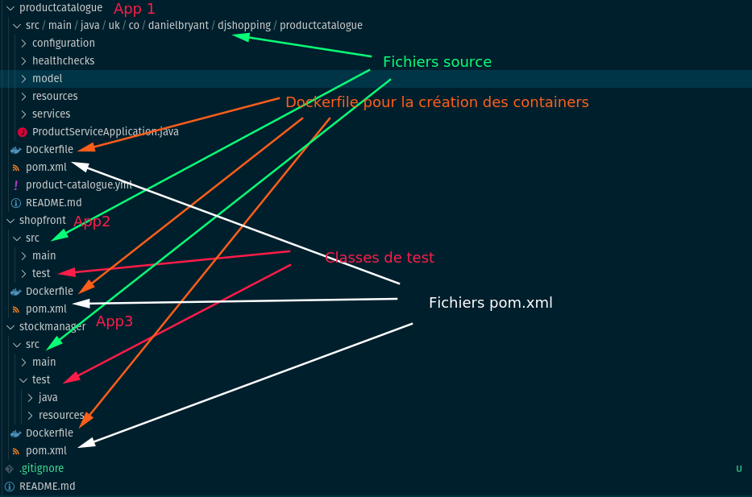
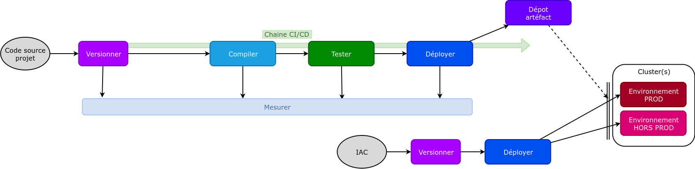
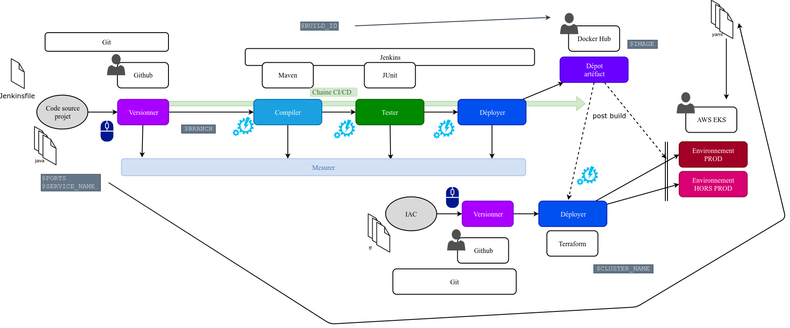
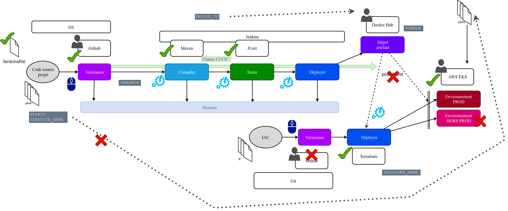
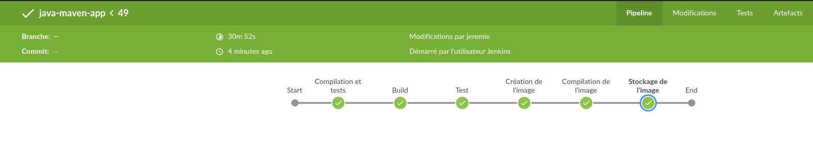
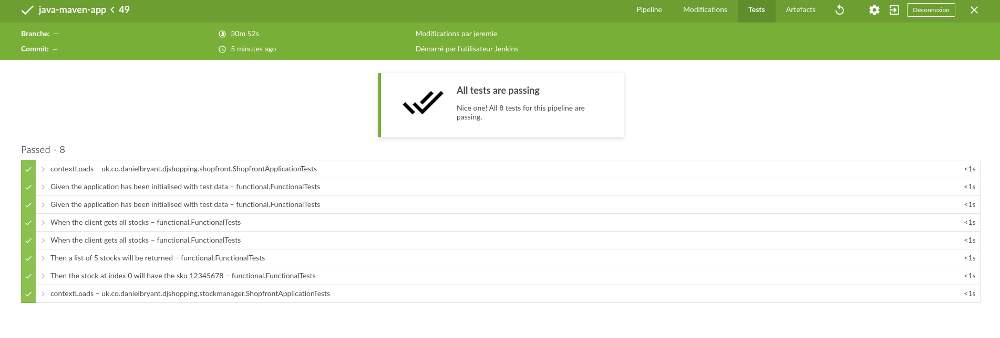
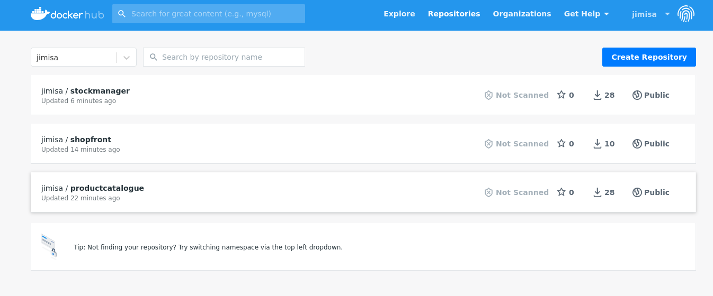

# Projet final formation Devops

## Phase préparatoire

### Github

1. Forker le code source sur le repo perso github

2. Cloner le repo en local + ajouter un fichier gitignore

```mkdir code```
```cd code && git clone https://github.com/Jimisa/JAVASampleAPP.git```

```cd JAVASampleAPP &&  curl -L https://www.toptal.com/Developers/gitignore/api/java,visualstudiocode,linux > .gitignore```

[Fichier gitignore java](https://www.toptal.com/developers/gitignore/api/java,visualstudiocode,linux)

__Arborescence du projet cloné :__

Les fichiers pom.xml servent de manifeste à l'outil de compilation Java

Le projet a 3 parties interdépendantes : ```stockmanager``` et ```productcatalogue``` sont 2 services consommés par l'application front ```shopfront```. Chaque sous projet est sensé être lancé dans un container (avec le DockerFile fourni).
Les classes de tests sont fournis pour ```shopfront``` et ```stockmanager```.

### Chaine CI/CD du projet



La chaine CI/CD du projet consiste à un enchainement d'étapes à partir d'un nouvel état dans l'outil de versioning. Toutes ces étapes peuvent être automatisées par des outils CI jusqu'à la mise à disposition des artefacts sur un dépot.
Les environnements de production peuvent par la suite récupérer ces artefacts et les installer pour les rendre accessibles aux clients (testeurs, clients finaux...).

#### Discussion et choix des outils

- __CI/CD__ : Pour pouvoir rapidement avoir une chaine CI/CD fonctionnelle, un outil comme __Jenkins__ et son système de plugins permet de créer des pipelines automatisés déclenchés depuis une action sur l'outil de SCM. Jenkins peut s'installer sur n'importe quelle machine ou container, localement ou chez un cloud provider. D'autres outils sont disponibles pour être utilisés sur des clusters (Jenkins X) et/ou des solutions de Cloud provider (AWS CodePipeline/AWS CodeBuild) qui s'intègrent facilement entre eux.
- __Registry__ : Les images peuvent être déposées sur un registry local ou sur un hub comme __Docker Hub__. Les cloud provider ont aussi une solution de dépot de containers (AWS ECR).
- __Environnements de déploiements__ : les containers des applications sortant de la chaine CI/CD peuvent tourner sur une machine sur laquelle se trouve un Docker Engine. On peut aussi monter une infra __Kubernetes__ qui déploient les pods à partir des images des containers sur le registry.
- __Outils de déploiements__ : L'idéal est de pouvoir monter à la demande un environnement de déploiements (phase de tests, staging, démo) qui serait le plus proche possible de l'infrastructure montée en production. Dans un environnement Kubernetes, soit un cluster est monté/démonté spécialement pour les besoins de tests à coté du cluster de prod, soit dans un seul cluster sont installés les deux environnements, isolés dans leur namespace (isolation moins bonne, impact sur les perfs de la prod...). Des outils de IAC comme __terraform__ permettent de monter toute l'infrastructure K8s et de la dupliquer. Les resources K8s y sont créés. Autre solution, installer des chart Helm propre à l'environnement au sein d'un même cluster.

> ___Ou installer Jenkins?___
>
>| |local|Remote|
>|------------|-------------|------------|
>| standalone | Solution la plus rapide, accès direct aux binaires appelés dans le pipeline. Mais mauvaise pratique, l'instance Jenkins n'est dispo que sur un poste. + gestion des agents (Containers, VM...) en plus | Bonne solution pour les équipes de développeurs. Gestion du serveur dédié pour Jenkins. Installation+configuration du serveur au préalable (on Premise ou Cloud Provider).  Possibilité d'utiliser une AMI Jenkins sur les marketplaces |
>| container | Léger et déployable rapidement. Permet de gérer toute l'infra CI (master, slave, plugin) dans des containers (isolation). Peut être migré vers une solution full remote. Demande plus de configuration en amont | intégration à un cluster Kubernetes par exemple ou à des solutions de services de containers proposés par des CLoud Provider |
>| VM | Installation pratique pour des tests et sauvegarde d'image. Plus lourd que les containers | Version Cloud de l'instal standalone.|

#### Outils utilisés



 et le résultat obtenu :

 

### Mise en place Jenkins

#### Installation des images Docker

Il y 2 containers pour faire tourner la chaine Jenkins:

- une image Jenkins avec un client Docker
- une image DinD pour pouvoir lancer des containers agent à la volée

Ces deux images sont dans un réseau "jenkins" et le container Jenkins utilise le Docker Engine pour lancer ses agents ```docker create network jenkins```

Créer une image Jenkins à partir de ce dockerfile :

```Dockerfile
FROM jenkins/jenkins:lts  
USER root
RUN apt-get update && apt-get install -y apt-transport-https \
       ca-certificates curl gnupg2 \
       software-properties-common
RUN curl -fsSL https://download.docker.com/linux/debian/gpg | apt-key add -
RUN apt-key fingerprint 0EBFCD88
RUN add-apt-repository \
       "deb [arch=amd64] https://download.docker.com/linux/debian \
       $(lsb_release -cs) stable"
RUN apt-get update && apt-get install -y docker-ce-cli
USER jenkins
RUN jenkins-plugin-cli --plugins "blueocean:1.24.6 docker-workflow:1.26 kubernetes-cli:1.10.0"
```

Démarrer les containers :

```bash
docker run --name jenkins-docker --rm --detach \
  --privileged --network jenkins --network-alias docker \
  --env DOCKER_TLS_CERTDIR=/certs \
  --volume jenkins-docker-certs:/certs/client \
  --volume jenkins-data:/var/jenkins_home \
  --publish 2376:2376 docker:dind --storage-driver overlay2
```

```bash
docker run --name jenkins-blueocean --rm --detach \
  --network jenkins --env DOCKER_HOST=tcp://docker:2376 \
  --env DOCKER_CERT_PATH=/certs/client --env DOCKER_TLS_VERIFY=1 \
  --publish 8080:8080 --publish 50000:50000 \
  --volume jenkins-data:/var/jenkins_home \
  --volume jenkins-docker-certs:/certs/client:ro \
  --volume "$HOME":/home \
  myjenkins:1.1 
  ```

Configuration de l'instance Jenkins:

- Nouvel utilisateur
- Ajout des credentials pour Github, Docker Hub
- Création d'un job Jenkins 'pipeline' en lien avec le repo GitHub cloné

Dans le repo, ajouter un Jenkinsfile dans lequel sera configuré la chaine CI/CD.

1. compilation du code Java avec un __agent Maven__ (container)
2. test du code et affichage du rapport JUnit
3. construction et tags des images Docker après compilation
4. push vers un registry Docker Hub
5. ~~déployer sur un cluster de test~~

```Jenkinsfile
pipeline {
    agent any
    stages {
        stage('Compilation et tests') {
            agent {
                docker {
                    image 'maven:3.8.1-adoptopenjdk-11' 
                    args '-v /root/.m2:/root/.m2' 
                    reuseNode true
                }
            }
            stages{
                stage('Build') { 
                    steps {
                        sh 'mvn -f productcatalogue/pom.xml -B -DskipTests clean package'
                        sh 'mvn -f shopfront/pom.xml -B -DskipTests clean package'
                        sh 'mvn -f stockmanager/pom.xml -B -DskipTests clean package'
                    }
                }
                stage('Test') {
                    steps {
                        sh 'mvn test -f shopfront/pom.xml'
                        sh 'mvn test -f stockmanager/pom.xml'
                    }
                    post {
                        always {
                            junit 'shopfront/target/surefire-reports/*.xml'
                            junit 'stockmanager/target/surefire-reports/*.xml'
                        }
                    }
                }
            }
        }
        stage('Création de l\'image') {
            stages {
                stage('Compilation de l\'image') {
                    steps {
                        sh """#!/bin/bash -xe
                        docker build -t jimisa/productcatalogue:${env.BUILD_ID} productcatalogue/
                        docker tag jimisa/productcatalogue:${env.BUILD_ID} jimisa/productcatalogue:latest
                        docker build -t jimisa/shopfront:${env.BUILD_ID} shopfront/
                        docker tag jimisa/shopfront:${env.BUILD_ID} jimisa/shopfront:latest
                        docker build -t jimisa/stockmanager:${env.BUILD_ID} stockmanager/
                        docker tag jimisa/stockmanager:${env.BUILD_ID} jimisa/stockmanager:latest
                        """
                    }
                }
                stage('Stockage de l\'image') {
                    steps {
                        withCredentials([usernamePassword(credentialsId: 'docker-hub', usernameVariable: 'USERNAME', passwordVariable: 'PASSWORD')]) {
                            sh """#!/bin/bash -xe
                            docker login -u ${USERNAME} -p ${PASSWORD}
                            docker push jimisa/productcatalogue:${env.BUILD_ID}
                            docker push jimisa/productcatalogue:latest
                            docker push jimisa/shopfront:${env.BUILD_ID}
                            docker push jimisa/shopfront:latest
                            docker push jimisa/stockmanager:${env.BUILD_ID}
                            docker push jimisa/stockmanager:latest
                            """
                        }
                    }
                }
            }
        }
        // stage('Deploiement sur Kubernetes') {
        //     steps {
        //         withKubeConfig({credentialsID: 'kubeconfig'}) {
        //             sh 'kubectl create -f deployment.yaml'
        //             sh 'kubectl create -f service.yaml'
        //         }
        //     }
        // }
    }
}
```

### Résultats







> #### Remarques et TODO list
>
>- J'ai désactivé le _SCM polling_ pour les tests, mais cette solution n'est pas idéale. Il faudrait plutôt ajouter un webhook dans GitHub, ce qui nécessite une entrée DNS pour l'instance Jenkins.
>- Le projet est constitué en 3 parties qui doivent se développer indépendemment (par des équipes différentes?). Ma solution compile et teste tous les projets du repo sans distinguer quelle partie a été modifiée. On peut imaginer avoir _3 jobs Jenkins_ qui ne sont liés qu'à un sous projet (dans ce cas, il faut 3 repo distincts??)
>- Chaque job prend plus de 20 minutes, trop long pour des tests.
>- Le projet _n'est pas multibranche_, mais on pourrait configuer le job en fonction de la branche : sur la branche de développement, pour la version de prod, on va jusqu'à livrer l'image sur le Hub, pour la branche dev, il peut y avoir un déploiement sur un environnement de test.
>- Je n'ai pas réussi à déployer les images vers un cluster Kubernetes dans le pipeline Jenkins (pb de credentials, de temps alloué, et de paramétrages*).
>\* Déployer via des fichiers yaml, il faut pouvoir renseigner des paramètres qui sont actuellement dans le code : port, nom du service... Il faut aussi configurer le fichier .kube/config pour utiliser le bon cluster.

## Déploiement avec Kubernetes

### Choix de l'hébergement du cluster

Pour des raisons de simplicité, le choix s'est porté sur le service EKS d'AWS.

Pour utliser EKS, il faut créer un VPC divisé en sous réseaux pour héberger les instances EC2 des __worker nodes__.

### Pourquoi un déploiement par Terraform

Terraform permet la gestion des ressources au cours du cycle de vie de l'environnement, et de s'assurer que les ressources sont bien détruites à la fin. Grace au provider ___aws___  de Terraform, la gestion des ressources nécessaires à la création d'un cluster EKS se fait dans un fichier. On peut rapidement installer et désintaller l'infra AWS d'un compte à un autre, et s'assurer qu'il ne reste pas de services activés (-> $$$).

> __Terraform destroy__
> Après construction du cluster et déploiement des resources Kubernetes, la destruction des ressources renvoie une erreur à la suppression des sous réseaux. Ca serait lié à la création du service LoadBalancer qui n'est pas gérer par Terraform.

```hcl
terraform {
  required_providers {
    aws = {
      source  = "hashicorp/aws"
      version = "~> 3.27"
    }
  }

  required_version = ">= 0.14.9"
}

provider "aws" {
    profile = "default"
    region  = var.region

    default_tags {
        tags = {
            Name = var.projectname_tag
            Environnement = var.environment_tag
        }
    }
}

locals {
  cluster_name = "cluster-${var.projectname_tag}"
}

resource "aws_key_pair" "deployer" {
  key_name   = "deployer-key"
  public_key = "ssh-rsa AAAAB3NzaC1yc2EAAAADAQABAAABAQDL7OTe77JwUq31lMa7fvqpPgD9X85wTWKq9bgp9Jx8rpNHyOsIildH/lBlEApPDiSpVWatkfz6PHiUHueWua8u2LpM2n8cdqKq8QqPZbekmSKKrGGmtj6BPy5r+6+/J3cuNtUYByySgDglpbXH4QWwD8uAKbJlv8OUpi1MxafiA1h72WSzjDnznESU5xGWKqz5EwYZToQspmUkKRN+bwuxRoM+gq8RqwwzmwRLIbp01PWsVrCfrw376uP+nD6U5+nes8FwFiFtj6yvPlw4XxrQ/CVQ9ADnRu2ru3NYi0JaFTT2St0FbBPx+QWj+Up4MmTT+AjXO0kljWQXHH7DZdn5 jimisa@pop-os"
}

resource "aws_vpc" "vpc"{
    cidr_block = var.cidr_vpc
  enable_dns_support   = true
  enable_dns_hostnames = true
}

resource "aws_subnet" "subnet_1" {
    vpc_id = aws_vpc.vpc.id
    cidr_block = var.cidr_subnet_1
    map_public_ip_on_launch = true
    availability_zone = "${var.region}a"

    tags = {
      "kubernetes.io/cluster/${local.cluster_name}" = "shared"
      "kubernetes.io/role/elb" = "1"
    }
}

resource "aws_subnet" "subnet_2" {
    vpc_id = aws_vpc.vpc.id
    cidr_block = var.cidr_subnet_2
    map_public_ip_on_launch = true
    availability_zone = "${var.region}b"
}

resource "aws_internet_gateway" "igw" {
    vpc_id = aws_vpc.vpc.id
}

resource "aws_route_table" "rt" {
    vpc_id = aws_vpc.vpc.id
    route {
      cidr_block = "0.0.0.0/0"
      gateway_id = aws_internet_gateway.igw.id
    }
}

resource "aws_main_route_table_association" "a" {
  vpc_id         = aws_vpc.vpc.id
  route_table_id = aws_route_table.rt.id
}

resource "aws_security_group" "sg" {
    vpc_id = aws_vpc.vpc.id

    egress {
      description = "Allow All"
      cidr_blocks = [ "0.0.0.0/0" ]
      ipv6_cidr_blocks = [ "::/0" ]
      protocol = "-1"
      from_port = 0
      to_port = 0
    }
}

resource "aws_iam_role" "iamr-eks" {
  name = "eks-cluster-role"

  assume_role_policy = <<POLICY
{
  "Version": "2012-10-17",
  "Statement": [
    {
      "Effect": "Allow",
      "Principal": {
        "Service": "eks.amazonaws.com"
      },
      "Action": "sts:AssumeRole"
    }
  ]
}
POLICY
}

resource "aws_iam_role_policy_attachment" "AmazonEKSClusterPolicy" {
  policy_arn = "arn:aws:iam::aws:policy/AmazonEKSClusterPolicy"
  role       = aws_iam_role.iamr-eks.name
}

# Optionally, enable Security Groups for Pods
# Reference: https://docs.aws.amazon.com/eks/latest/userguide/security-groups-for-pods.html
resource "aws_iam_role_policy_attachment" "AmazonEKSVPCResourceController" {
  policy_arn = "arn:aws:iam::aws:policy/AmazonEKSVPCResourceController"
  role       = aws_iam_role.iamr-eks.name
}

resource "aws_eks_cluster" "eks" {
  name = local.cluster_name
  role_arn = aws_iam_role.iamr-eks.arn
  enabled_cluster_log_types = [ "api", "audit", "authenticator", "controllerManager", "scheduler" ]

  vpc_config {
    subnet_ids = [aws_subnet.subnet_1.id,aws_subnet.subnet_2.id]
    security_group_ids=[aws_security_group.sg.id]
    endpoint_private_access = true
    endpoint_public_access = true
  }

  depends_on = [
    aws_iam_role_policy_attachment.AmazonEKSClusterPolicy,
    aws_iam_role_policy_attachment.AmazonEKSVPCResourceController,
  ]

 

}

resource "aws_iam_role" "iamr-ng" {
  name = "eks-node-group"

  assume_role_policy = jsonencode({
    Version = "2012-10-17"
    Statement = [{
      Action = "sts:AssumeRole"
      Effect = "Allow"
      Principal = {
        Service = "ec2.amazonaws.com"
      }
    }]
  })
}

resource "aws_iam_role_policy_attachment" "AmazonEKSWorkerNodePolicy" {
  policy_arn = "arn:aws:iam::aws:policy/AmazonEKSWorkerNodePolicy"
  role       = aws_iam_role.iamr-ng.name
}

resource "aws_iam_role_policy_attachment" "AmazonEKS_CNI_Policy" {
  policy_arn = "arn:aws:iam::aws:policy/AmazonEKS_CNI_Policy"
  role       = aws_iam_role.iamr-ng.name
}

resource "aws_iam_role_policy_attachment" "AmazonEC2ContainerRegistryReadOnly" {
  policy_arn = "arn:aws:iam::aws:policy/AmazonEC2ContainerRegistryReadOnly"
  role       = aws_iam_role.iamr-ng.name
}

resource "aws_eks_node_group" "eks-ng" {
  cluster_name    = aws_eks_cluster.eks.name
  node_group_name = "ng-${var.projectname_tag}"
  node_role_arn   = aws_iam_role.iamr-ng.arn
  subnet_ids      = [aws_subnet.subnet_1.id, aws_subnet.subnet_2.id]

  scaling_config {
    desired_size = 2
    max_size     = 2
    min_size     = 1
  }

  # Allow external changes without Terraform plan difference
  lifecycle {
    ignore_changes = [scaling_config[0].desired_size]
  }

  remote_access {
    ec2_ssh_key= aws_key_pair.deployer.id
  }
  # Ensure that IAM Role permissions are created before and deleted after EKS Node Group handling.
  # Otherwise, EKS will not be able to properly delete EC2 Instances and Elastic Network Interfaces.
  depends_on = [
    aws_iam_role_policy_attachment.AmazonEKSWorkerNodePolicy,
    aws_iam_role_policy_attachment.AmazonEKS_CNI_Policy,
    aws_iam_role_policy_attachment.AmazonEC2ContainerRegistryReadOnly,
  ]
}

# resource "aws_instance" "app_server" {
#   ami           = "ami-043097594a7df80ec"
#   instance_type = "t2.micro"

#   tags = {
#     Name = "ExampleAppServerInstance"
#   }
# }
```

### Ressources Kubernetes

Pour tester l'application, le minimum est de déployer:

- les __3 containers du projet__, en les prenant sur le registry Docker. La version _latest_ pour s'assurer de prendre la dernière version produite.
- trois services pour communiquer avec les applications. Les containers arrivent à communiquer entre eux grâce à ces services. Pour les exposer vers l'extérieur, il est possible d'ouvrir un port statique (Nodeport) pour les admin, d'utiliser un service de type LoadBalancer (pour le front) ou bien un Ingress.

#### Service.yaml

```yaml
apiVersion: v1
kind: Service
metadata:
  name: shopfront
spec:
  selector:
    app: javasampleapp
  type: LoadBalancer
  ports:
  - port: 8010 
    targetPort: 8010
---
apiVersion: v1
kind: Service
metadata:
  name: productcatalogue
spec:
  selector:
    app: javasampleapp
  type: NodePort
  ports:
  - port: 8020 
    targetPort: 8020
    nodePort: 30082
---
apiVersion: v1
kind: Service
metadata:
  name: stockmanager
spec:
  selector:
    app: javasampleapp
  type: NodePort
  ports:
  - port: 8030 
    targetPort: 8030
    nodePort: 30083

```

#### Deployment.yaml

```yaml
apiVersion: apps/v1
kind: Deployment
metadata:
  name: javasampleapp-deployment
  labels:
    app: javasampleapp
spec:
  replicas: 2
  selector:
    matchLabels:
      app: javasampleapp
  template:
    metadata:
      labels:
        app: javasampleapp
    spec:
      containers:
      - name: shopfront
        image: jimisa/shopfront:latest
        ports:
        - containerPort: 8010
      - name: productcatalogue
        image: jimisa/productcatalogue:latest
        ports:
        - containerPort: 8020
      - name: stockmanager
        image: jimisa/stockmanager:latest
        ports:
        - containerPort: 8030
```
## Example de service ouvert (ShopFront)

